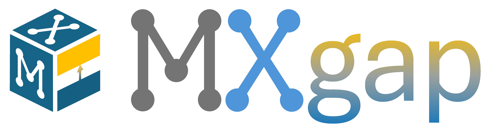

# MXgap: A Machine Learning Program to predict MXene Bandgaps

<br>
<p align="center">

</p>

[](https://pypi.org/project/mxgap/)
[](https://github.com/diegonti/mxgap/actions/workflows/python_tests.yaml)


## About

`mxgap` is a computational tool designed to streamline electronic structure calculations for MXenes using hybrid functionals like PBE0. By employing Machine Learning (ML) models, mxgap predicts the PBE0 bandgap based on features extracted from a PBE calculation. Here’s a detailed overview of its functionality:

### 1. Feature Extraction:
- Automatically extracts essential features and key data from a PBE calculation output, specifically tailored for [VASP](https://www.vasp.at/) (Vienna Ab initio Simulation Package) outputs.
- It leverages the structural information from the CONTCAR file, and optionally users can choose to include the density of states (DOS) from the DOSCAR file to enhance prediction accuracy, depending on the selected ML model.
- The program is designed for periodic systems. So, for now, it expects a *p*($1\times1$) terminated MXene unit cell in the CONTCAR file for proper functionality.

### 2. ML Prediction:
- Uses trained ML models to predict bandgap values, reducing the computational cost associated with performing full PBE0 calculations.
- Several ML models have been trained and are available to use. The default (and best) one is a combination of a Classifier (GBC) that discriminates metallic or semiconductor MXenes and a Regressor (RFR, trained with semiconductor MXenes) to predict the bandgap. More info about the ML models in the [models/](mxgap/models/) folder.


### 3. Output:
- Generates a report file, `mxgap.info`, which contains the ML predictions and results.


<br>

This program is based on the data gathered in our works: [*J. Mater. Chem. A*, 2023, 11, 13754-13764](https://doi.org/10.1039/D3TA01933K) and [*Energy Environ. Mater.*, 2024, 0, e12774](https://doi.org/10.1002/eem2.12774). 

<!-- And the ML program and results have been published in [paper4](paper4). If use this, please cite:
```
D. Ontiveros, S. Vela, F. Viñes, C. Sousa, _Journal_, Year, Volume, Pages. DOI: doi
```  -->


## Installation

`mxgap` works for python >= 3.9, and can be installed using the Python package manager `pip`:

```
pip install mxgap
```

If you use conda/anaconda, the safest thing to do is to create a new environment and then install `mxgap`:

```
conda create -n mxgap python
conda activate mxgap
pip install mxgap
```

If you wish, you can install the latest version of `mxgap` from GitHub source with the commands below:

```
git clone https://github.com/diegonti/mxgap.git
cd mxgap
pip install .
```


## Usage
The program is mainly used through the CLI:

```
mxgap [-h] [-f CONTCAR [DOSCAR]] [-m MODEL] [PATH]
```
With the arguments and options explained below:
```
positional arguments:
  path                  Specify the path to the directory containing the calculation output files, if empty, will select the current directory. Must contain at least the optimized CONTCAR, and the PBE DOSCAR for the PBE trained models.

options:
  -h, --help            show this help message and exit
  -f FILES [FILES ...], --files FILES [FILES ...]
                        Specify in order the CONTCAR and DOSCAR (if needed) paths manually. The path positional argument has preference over this.
  -m MODEL, --model MODEL
                        Choose the trained MXene-Learning model to use. By default, the most accurate version is selected (GBC+RFR_onlygap).
  -l, --list            List of all trained ML models available to choose.
```
So, for a quick example, the below command will look for the CONTCAR and DOSCAR files in the specified folder and use the default (best) ML model to predict the bandgap.
```
mxgap examples/La2C1Cl2/
```

Also, the program can be imported as a python module. See the [Jupyter Notebook](tutorials.ipynb) for some tutorials. Here is a quick example:

```python
from mxgap.ML import ML_prediction

contcar_path = "examples/La2C1Cl2/CONTCAR"
doscar_path  = "examples/La2C1Cl2/DOSCAR"
model        = "GBC+RFR"
prediction   =  ML_prediction(contcar_path, doscar_path, model)
```


## Tests

You can run tests locally using `pytest` in the project folder:
```
cd mxgap
pytest
```


## Help

To get information about the program and its use, run the command:

```
mxgap -h
```

For any more doubts or questions, feel free to contact [me](mailto:diegonti.doc@gmail.com).